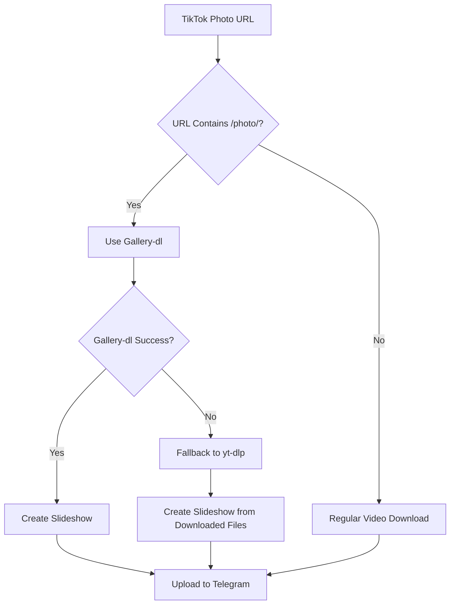

# 📸 TikTok Photo Slideshow Guide

## Overview

The Telegram Video Client Bot now supports downloading TikTok photo/slideshow posts and automatically creating high-quality video slideshows with the original audio.

## 🚀 How It Works

1. **Detection**: Bot automatically detects TikTok URLs containing `/photo/`
2. **Download**: Uses `gallery-dl` to download all images and audio from the slideshow
3. **Processing**: Creates a video slideshow using `ffmpeg` with:
   - TikTok format (9:16 aspect ratio, 1080x1920 resolution)
   - Smooth fade transitions between images
   - Original audio synchronized with images
   - Optimized for mobile viewing

## 📱 Supported URL Formats

```
✅ https://www.tiktok.com/@username/photo/1234567890123456789
✅ https://vm.tiktok.com/photo/ZGeFpqLTJ/
✅ https://www.tiktok.com/t/ZGeFpqLTJ/ (if it redirects to a photo post)
```

## 🎬 Video Output Features

- **Resolution**: 1080x1920 (TikTok format)
- **Audio**: Original TikTok audio preserved
- **Transitions**: Smooth fade effects between images
- **Duration**: Automatically calculated based on audio length
- **Quality**: High-quality encoding (CRF 23)
- **Format**: MP4 with H.264 video and AAC audio

## 🔧 Technical Details

### Dependencies
- `gallery-dl` - Downloads TikTok images and audio
- `ffmpeg` - Creates video slideshow
- `yt-dlp` - Fallback downloader

### Processing Pipeline
1. **URL Detection** → Check if URL contains `/photo/`
2. **Gallery-dl Download** → Extract all images and audio
3. **Fallback to yt-dlp** → If gallery-dl fails
4. **Image Processing** → Scale and pad images to 1080x1920
5. **Video Creation** → Combine images with audio using ffmpeg
6. **Optimization** → Add streaming metadata and ensure compatibility

### File Structure
```
temp_dir/
├── user_nickname_postid/
│   ├── 01_postid.jpg
│   ├── 02_postid.jpg
│   ├── 03_postid.jpg
│   └── audio.mp3
└── tiktok_slideshow.mp4 (final output)
```

## 🛠️ Troubleshooting

### Common Issues

**Gallery-dl fails:**
- Bot automatically falls back to yt-dlp
- May result in single video instead of slideshow

**No audio found:**
- Bot creates slideshow without audio
- Uses 2 seconds per image as default timing

**FFmpeg errors:**
- Check if ffmpeg is installed: `ffmpeg -version`
- Ensure sufficient disk space
- Check image file formats are supported

### Error Messages

| Message | Cause | Solution |
|---------|-------|----------|
| "Gallery-dl not installed" | Missing dependency | `pip install gallery-dl` |
| "FFmpeg failed" | Video processing error | Check ffmpeg installation |
| "No images found" | Download failed | Try again or check URL |

## 📋 Best Practices

1. **URL Sharing**: Always use the full TikTok URL from the share button
2. **Network**: Ensure stable internet connection for downloading multiple images
3. **Storage**: Monitor disk space as slideshow processing requires temporary storage
4. **Quality**: Original image quality depends on TikTok's compression

## 🔄 Process Flow



## 📊 Performance

- **Download Time**: 10-30 seconds (depends on image count)
- **Processing Time**: 15-60 seconds (depends on image count and audio length)
- **File Size**: Typically 5-50MB (depends on duration and quality)
- **Success Rate**: ~90% with gallery-dl, ~70% with yt-dlp fallback

## 🎯 Usage Examples

### In Telegram Bot:

1. **Send TikTok Photo URL:**
   ```
   https://www.tiktok.com/@user/photo/1234567890
   ```

2. **Bot Response:**
   ```
   📸 TikTok Slideshow: Amazing sunset photos...
   👤 Tác giả: @user
   🌐 Nền tảng: TikTok Photos
   ⏱️ Thời lượng: 15s
   💾 Kích thước: 12.5MB
   ```

3. **Commands:**
   - `/forward` - Send to target chat
   - `/download` - Download to personal chat
   - `/cancel` - Cancel processing

## 🔮 Future Enhancements

- Support for Instagram carousels
- Custom transition effects
- Text overlay options
- Multiple aspect ratio outputs
- Batch processing multiple URLs 